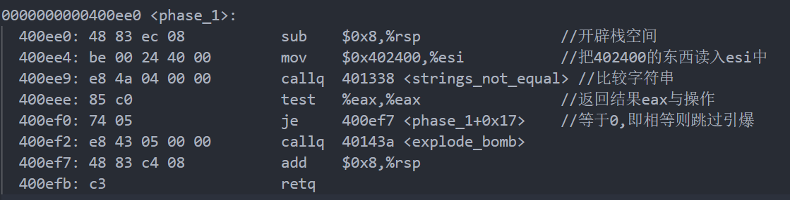
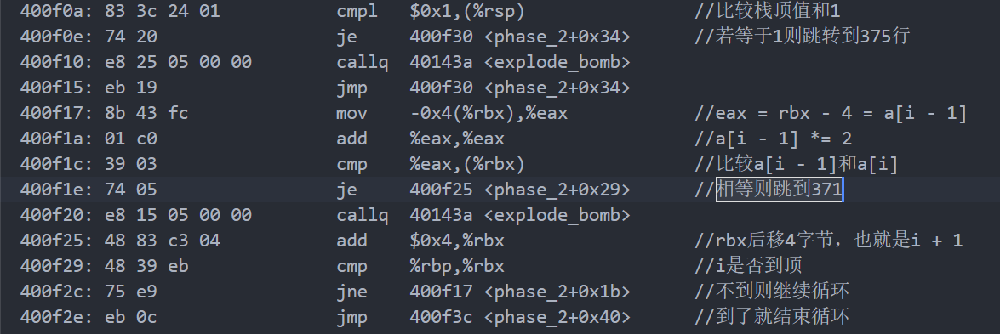
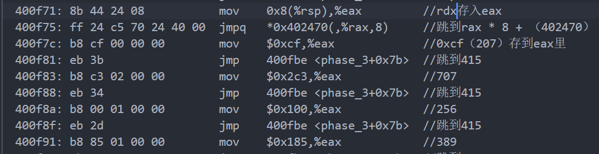
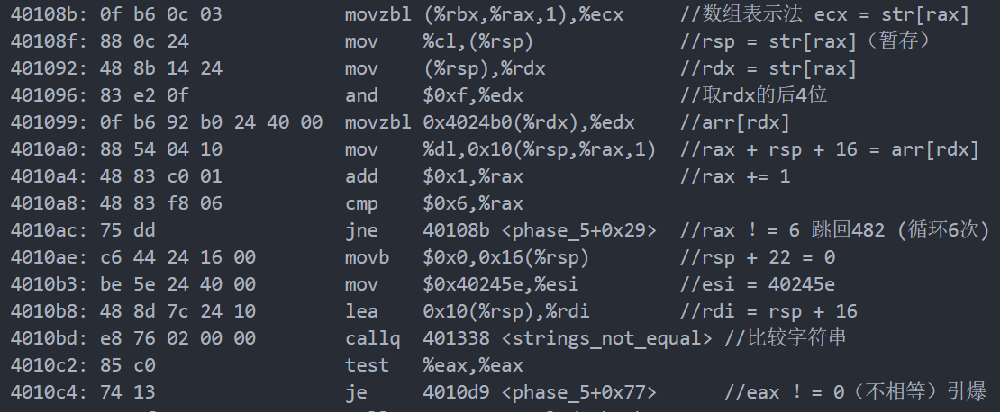
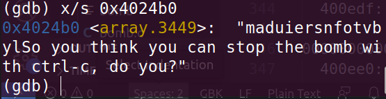

##### 前置知识

寄存器：

rsp 标识栈顶		rdi rsi rdx 存储参数		eax 累加器		esi 源寄存器

gdb：

x/s 输出指定内存的字符串

x/x 输出指定内存的十六进制表示

一共6关，每一关都要输入正确的字符串才能通过，给出可执行文件bomb，需要通过反汇编得到其汇编代码，阅读汇编代码判断正确的字符串

使用objdump -d bomb > bomb.txt将反汇编结果输出到txt文件中便于阅读。

##### phase_1



代码比较短，忽略开辟空间的那部分，phase_1主要做了两件事：1、把esi存到地址0x402400处；2、调用函数比较两个字符串是否相等。eax存储函数的返回结果，查看strings_not_equal的代码可知若不相等返回1，相等返回0。

显然0x402400是个比较奇怪的地方，它在代码段找不到，又被用来比较字符串。通过gdb bomb，x/s 0x402400查看此处内容，发现一个字符串：

Border relations with Canada have never been better.

这个就是答案


##### phase_2



主要代码如上，这里注意两个寄存器rbx和rsp，rsp存储了数组的第一个元素值，rbx是基址寄存器，用于存储数组的首地址，代码中rbx每次都后移4位，也就是移动到数组的下一个元素，相当于for循环。同时eax存储上一个rbx（上一个数组元素）并且乘2，并和rbx进行比较。用c语言表示就是a[i]和a[i - 1] * 2的比较。

输入几位呢？read_six_numbers暗示了答案，另一方面，可以发现依然有一个超过了代码段的怪地址0x40145c，用x/s查看发现等于%d %d %d %d %d %d，证实了输入6位数字。

第一个元素（rsp）必须是1，后面每一位都是前一位2倍，故答案为：

1 2 4 8 16 32


##### phase_3

又出现了0x40145c，查看是：%d %d，说明这次需要输入2个数

两个参数rdx和rcx



代码主体由一系列跳转组成，跳转的结果取决于 jmpq   *0x402470(,%rax,8)

rax就是读入的第一个参数rdx，也就是要查看0x402470 + rax处的东西


可以看到这是一个跳转表，由0x402470的偏移决定跳转位置，而第一个参数0 <= rax <= 7正好对应了这8种跳转位置，若第一个参数为0，那么无偏移对应0x400f7c，也就是mov 207 eax，若第一个参数为1，那么偏移一格对应0x400fb9，也就是mov 207 eax......共8组答案：

0-207 1-311 2-707 3-256 4-389 5-206 6-682 7-327


##### phase_4

本关输入和上一关有点类似，查看特殊地址0x4025cf发现 %d %d，也是输入2个数。同样存储在rdx和rcx中，从401056可知rcx必须等于0否则引爆，这就马上确定了第一个参数。再看第二个参数rdx，由401033知rdx <= 14，然后调用func4

func4内主要是eax、edx、ecx这几个寄存器在做操作，耐心得理清楚可以得到以下代码：

```c
int func4(int target, int a, int b)
{
    int ret = b - a;
    int k = (unsigned)(ret) >> 31;
    ret = (ret + k) >> 1;
    k = ret + a;
    if(k > target)
        return 2 * func4(target, a, k - 1);
    ret = 0;
    if(k < target)    
        return 2 * func4(target, k + 1, b) + 1;
    return ret;
}
```

（eax就是ret，edx就是b，ecx就是k，esi就是a，edi就是target）

已知a = 0， b = 14，且func4返回0才能不爆炸，edi（rdx）应该是多少？

因为k>=0，故target也要大于0，前面已知它<=14，写个迭代即可

```c
    for(int i = 0; i <= 14; i++)
    {
        if(func4(i, 0, 14) == 0)
            printf("%d\n", i);
    }
```

输出结果为0 1 3 7，所以有4组答案：

0 1 3 7 - 0


##### phase_5

前面都差不多，开空间和限定输入长度。比较有意思的是这句：

mov    %fs:0x28,%rax	一开始不知道什么意思，后来才想起是书上讲的“金丝雀”，程序的最后判断了它是否被改过，改过则调用栈溢出的处理，不过本题没用上这个东西，只是带看了一眼。



回归正题，这里需要熟悉数组的汇编表示（第一句），括号中间的值rax是数组索引，注意到除了第一句后面401099也是一个数组，它是以0x4024b0为基地址，第一个数组的值rdx为索引的数组。

后续比较乱先跳过，看最后几行需要比较字符串，比较对象是esi和rdi，rdi的值rsp + 10就是之前的嵌套数组，x/s看一下esi 0x40245e的值：flyers

也就是说嵌套数组arr[4024b0 + rdx]的值要和该字符串相同，为了确定偏移大小，再看一下0x4024b0：



这是一个字符串，我们需要从中找到flyers，可以发现这6个字符的偏移分别是9、15、14、5、6、7，也就是我们输入的字符要转化为这些偏移量。如何转化？从401096可知取了读入字符的后4位，也就是读入字符ascii码的二进制后四位与这些偏移量相同即可。可以直接找以这些偏移量为ascii码的字符，但为了方便给每个偏移量加上96（0110 xxxx），这样不影响末4位，于是有答案：

ionefg


##### phase_6

多少有点长了......

做到此处基本没剩多少耐心了，汇编也没细看，从博客大概了解了一下思路。

首先读入6个数，然后对这些数进行限定，每个数都要小于等于6，该数组以rsp为基地址，r13为索引，但没完。4001138的mov    (%rsp,%rax,4),%eax 从数组中得到偏移4位的数，也就是a[r13]的下一个数，如果相等则引爆，之后索引ebx后移一位，接着与rbx比较。也就是说每次先确定一个a[i]，之后从i + 1开始的数不能和a[i]相同，简而言之就是这6个数各不相同：

```c
for(int i = 0; i < 6; i++)
{
	for(int j = i + 1; j < 6; j++)
	{
		if(a[j] == a[i])
			bomb();
	}
}
```

下一部分很好理解，就是edx = 7 - a[i]，再把edx赋给a[i]。用7减去每个数得到新的数组a

再往后看，首先有一个奇怪的地址0x6032d：


这里有6个节点，第一列的值未知，第二列正好是1-6，第三列是下一节点的地址，所以这是一个链表。之后是一大堆循环的汇编，作用是修改链表的next指针，以第一列的那个参数为标准，链表应该是递减的。于是得到顺序3 4 5 6 1 2，这是由7-a[i]得来的，故原本的顺序为：

4 3 2 1 6 5

##### phase_secret

bomb.c有一段注释：    Wow, they got it!  But isn't something... missing?  Perhaps. something they overlooked?  Mua ha ha ha ha!

还藏东西了...在bomb的汇编文件中可以找到secret phase，它的触发条件是第四关的输入和0x402622处的东西进行比较，若相等则触发。查看0x402622发现是Dr.Evil，于是在第四关额外输入该字符串最后就能进入secret了。

fun7是一个递归函数，它的一个参数是0x6030f0，先看一眼


这次节点的内容更多，可以发现每个节点都有2个地址指向其他节点，很容易想到二叉树，罗列一下节点值会发现还是一棵二叉搜索树：

​							24

​				8					32

​		6	       16	   2d           65

​	 1   7      14  23 28 2f  	63 3e9

需要读入一个值使fun7返回2才能避免爆炸，fun7的c表示为：

```c
int fun7(node *cur, int i)
{
	if(cur == null)
		return -1;
	int key = cur->val;
	if(i > key)
		return 2 * fun7(cur->right, i) + 1;
	else if(i == key)
		return 0;
	else
		return 2 * fun7(cur->left, i);
}
```

要返回2有两种情况。因为递归到底返回0,非0数要i > key时产生，产生后再乘2即可，所以可以先左后右，这样递归返回1然后乘2变为2，符合要求，此时答案为0x16即22；其实还能接着走，因为后续递归返回0并不影响，所以走到0x16后接着往左，0x14即20，所以答案为：

20 或 22


至此就完成全部bomb lab了，汇编麻烦的地方在于寄存器太乱了，不像变量那样直观有意义。第一次做这么底层的lab还是很生涩，对gdb、寄存器和函数参数都不熟悉，距离看完csapp第三章也过了半个月，所以很多常见汇编表示都认不出来。不过磕磕绊绊做完后还是很有成就感的，对底层的认识也提升了不少。