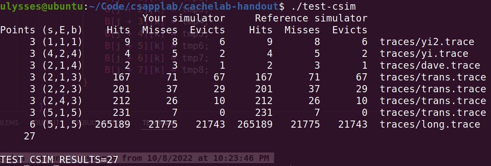

模拟cache那部分挺有意思，矩阵转置那部分处理点问题没做，大概了解了一下分块矩阵到的优化思路

##### A

要实现一个cache，使用lru替换算法。在lc做过lru的题后就觉得还好了，这里不追求O(1)的时间，所以不需要哈希链表的方法，cache本质上可以看作一个二维数组，它包含多个小数组（cache行），每个小数组里面放有元素。

1、每个cache行需要包含几个属性：有效位valid（判断这个该cache行能否存入数据，为1说明旧数据可以覆盖），tag字段（该数据和地址查找的是否匹配），时间戳stamp（用于记录多久未使用了，lru需要）。本实验不关心数据的内容，所以可以忽略数据。

可以把cache行和cache如下定义：

```c++
typedef struct
{
    int valid;
    int tag;
    int stamp;
} Line;

Line **cache = NULL;
```

2、地址包含几个属性：tag字段（和cache的tag进行匹配），组号（标记为哪个组，长度为s），数据位数（标记行内哪个字节，长度为b），一般组都不大，可以直接遍历搜索组内的cache行，所以这里不再设置行号

为了在cache中寻址，我们需要在地址中提取出tag和组号index。

tag在最前面，地址把组号和数据位s+b右移就可以得到

行号在中间，先让地址右移b位把组号移到边上，(1 << s) - 1得到s位的1，把它作为掩码相与就得到组号index了

```c++
int getTag(uint64_t addr, int s, int b)
{
    return addr >> (s + b);
}

int getIndex(uint64_t addr, int s, int b)
{
    return (addr >> b) & ((1 << s) - 1);
}
```


由于不关心数据内容，实验所说的存取都可以抽象为对cache的操作，只不过存是2次，取是1次，我们用updateCache表示一次操作。操作一次cache需要哪些修改？这需要分情况讨论。

若命中，把该行的stamp置0即可，表示刚访问过

若未命中，搜索组内有无空闲块，即valid=0，如果有则存在这，把tag改了，stamp置0，且valid改为1表示不可再存其他数据。如果没空闲块就需要根据lru驱逐一个，这里就要用到stamp

在index组内找含最大stamp的cache行，然后替换它。

```c++
    int max_stamp = INT_MIN;
    int max_idx = -1;
    for (int i = 0; i < E; ++i)
    {
        if (cache[index][i].stamp > max_stamp)
        {
            max_stamp = cache[index][i].stamp;
            max_idx = i;
        }
    }
    cache[index][max_idx].tag = tag;
    cache[index][max_idx].stamp = 0;
    miss++;
    evict++;
```

还有就是updateStamp，每轮操作之后都要执行一次使所有行的stmap加1

完成后编译出csim，运行test-csim，27分全通过




##### B

在学习局部性原理时经常拿矩阵来举例，按行遍历矩阵是好的习惯，因为同行元素在内存中相邻，可以同时被加载到cache行中；按列遍历可能因为元素距离较远而反复载入cache然后驱逐出cache，使得命中率降低。

优化矩阵转置的思路类似，矩阵转置需要操作B[j] [i] = A[i] [j]，其中一方肯定是要按列遍历矩阵的。实验给的cache每行可以存储32B数据，即4个int型变量，当矩阵大小为32 * 32时，一行有32个变量无法全部存到一个cache行内，显然按列遍历会导致频繁的未命中。

如果一次性不存一整行呢？在线代中学过矩阵分块，把矩阵分成几个小矩阵，分别运算再将结果相加不会影响最终结果，矩阵转置也有相同的性质，可以转化为多个小矩阵的转置，如果每个小矩阵能全部存入cache行就能一次载入多次使用了。

每个cache行只能存4个元素，所以把矩阵划分为2 * 2的小矩阵

因技术原因（没技术），这部分结果不能展示。